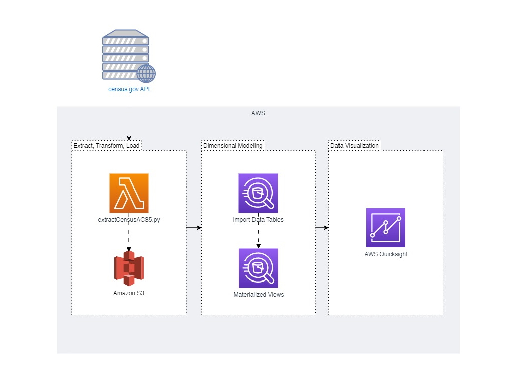

# Census ACS5 Data Pipeline
In this project I will utilize Python, SQL, and AWS to design and develop an ETL pipeline that extracts and visualizes data from the official Census ACS5 Survey API. This project serves as an exercise in developing data architectures that allow for easy access of real data that provides valuable insights to drive positive change in education outcomes in the US.

## Overview

**Extract, Transform, Load:**

In this phase, I will write an `AWS Lambda` function that extracts multiple datasets from the API, process and store them as .csv files on `Amazon S3`.

**Dimensional Modeling:**

I will then write SQL queries in `Amazon Athena` to organize the data and create materialized views for each measure and dimension.

**Data Visualization:**

Lastly, I will connect `Amazon Quicksight` to visualize the data.

For a comprehensive walkthrough of my process, refer to the detailed report located here: [report.md](report.md)

## About This Project
This project was personally designed to demonstrate proven experience in:
- Python scripting
- ETL development
- Leveraging SQL to organize client data
- Data mapping
- Dimensional star schema modeling
- Knowledge in utilizing AWS services

### Tools/Software
- Python 3.8
- pandas, requests, boto3, and io 
- AWS Lambda, S3, Athena, Quicksight, and Cloudshell
- Census.gov API

## About The Data

This project uses real data from the official Census American Community Survey API.

The Census American Community Survey (ACS) is an ongoing survey conducted by the United States Census Bureau that collects information on social, economic, housing, and demographic characteristics of the US population. The ACS5 is a specific dataset that provides 5-year estimates of these characteristics at the census block group, census tract, and other geographic levels. It includes a wide range of variables, such as income, education, employment, housing, and commuting, and can be used to analyze changes and trends in these areas over time. The ACS5 data is available through the Census Bureau's API and can be accessed by developers for use in their own applications and projects.

Learn more about Census ACS5 here: [https://www.census.gov/data/developers/data-sets/acs-5year.html](https://www.census.gov/data/developers/data-sets/acs-5year.html)
